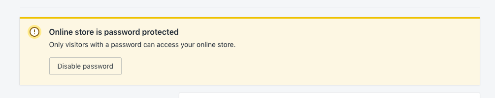

## Shopify Guide

### For admin

1. Log into [Shopify Partners](https://partners.shopify.com/)
2. Click on **Stores** on the sidebar.
3. Click on **Add store**.
4. Select **Development Store**.
5. Enter a **Store name**.
6. Enter **Passwords** \*Note this password is for your developer to login into the store.
7. **Store address**
8. Store is then created and ready to be handed over to a developer.

---

### For developer

1. Add Product

   - Click on **Products** on the sidebar.
     
   - Click on **Add product**.
   - Fill in the informations, then click on **Save** to add product.
     

2. Customizing Site

   - On the sidebar, under **Online Store**, click on **Themes**
     
   - **Disable password** for your shop. Don't forget to save!
     

   - Let's continue with themes. This page is where you can further customize your site.
     
     - **Customize** is where you can change the layout and also the content of your page!
     - **Theme library** section is where you can choose other themes for your site!

3. Add payment method

   - Click on **Settings** at the bottom of your sidebar.
     
   - Click on **Payment providers**.
     
     - Here you can add a variety of payment gateways like **PayPal**, **Stripe**, **Cash On Delivery** and so on.

4. Adding Apps

   If you need functionalities like a chat system on your site, you can implement it by installing apps onto shopify store!

   - Click on **Apps** on your sidebar.

     

   - Click on **Visit the Shopify App Store**
   - You'll be redirected to another page, where you can search for the functionality that you need and install the app to include it into your shopify.
    